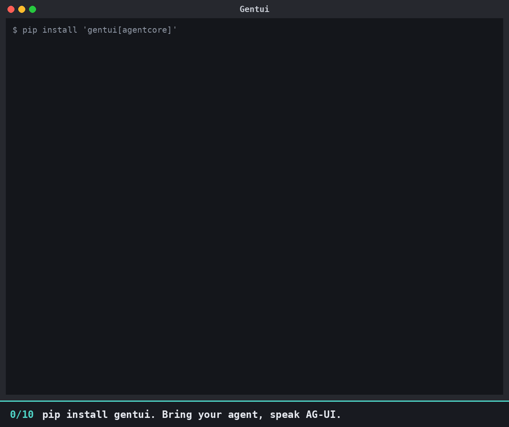
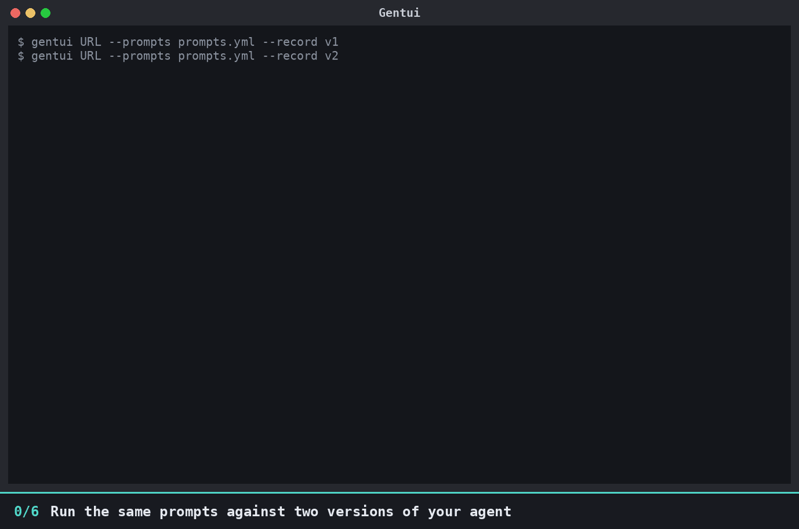

# Gentui

**A terminal interface for prototyping agents really quickly.** Point it at any [AG-UI](https://docs.ag-ui.com) backend and get
streaming chat, the model's chain of thought, tables, charts and human approval, with no frontend to build.



## Why Gentui?

While developing agents locally, we end up spending our time on the frontend: a Streamlit or Chainlit
app, or a React project, just to talk to the agent. Each one is a separate frontend to build and keep
running, and it slows down the thing you actually want to iterate on: the agent.

Gentui removes that step. Install it, point it at your agent's AG-UI endpoint, and you get a chat, the
model's **chain of thought**, **human-in-the-loop (HITL)** and **approval** flows out of the box, with no
frontend code to write. Change your agent, restart it, and you're prototyping again in seconds.

When the agent calls a tool, the **tool call becomes the UI**: a command to approve, a table, a chart,
a live plan. Nothing risky runs until you click **Approve**.

**Tested with the [Strands Agents](https://strandsagents.com) framework (AWS's open-source agent SDK) over
AG-UI**: both on a custom backend (the [example backend](https://github.com/rahrajlat/Gentui/tree/main/examples/strands-backend)) and on the official
[`ag-ui-strands`](https://pypi.org/project/ag-ui-strands/) adapter.

## Get started

```bash
pip install gentui                               # or: uv tool install gentui
gentui http://localhost:8000/agent               # your AG-UI endpoint
```

Requires Python 3.12 or newer. No backend yet? Try `gentui --demo`, which plays a tour of every feature by itself.

## What do you want to do?

| I want to | Read |
|---|---|
| install it and run the demo or the sample agent | [Getting started](getting-started.md) and [The sample agent](sample-agent.md) |
| see every command-line flag | [Command-line reference](cli.md) |
| use slash commands, themes and the event inspector | [Commands](commands.md) |
| save a session and play it back | [Record and replay](replay.md) |
| run the same prompts every time | [Run a set of prompts](prompts.md) |
| diff two runs of my agent side by side | [Compare runs](compare.md) |
| score how well two runs match, with my own judge model | [Judges](judges.md) |
| change colours, CSS and config | [Customising](customising.md) |
| add widgets, commands, event hooks or a judge | [Plugins](plugins.md) |
| build my own backend in any language | [Backend contract](tool-contract.md) |
| talk to an agent on Amazon Bedrock AgentCore | [AgentCore Runtime](agentcore.md) |
| understand the internals | [How it works](architecture.md) |
| contribute, run the tests, see what is verified | [Development and status](development.md) |
| cut a release | [Releasing](releasing.md) |

## Compare runs and judge them

Changed your agent's prompt or model? Run the same prompts against both versions and diff them side by side, with a
judge that scores the match for each prompt.



[Compare runs](compare.md){ .md-button .md-button--primary } [Write a judge](judges.md){ .md-button }
